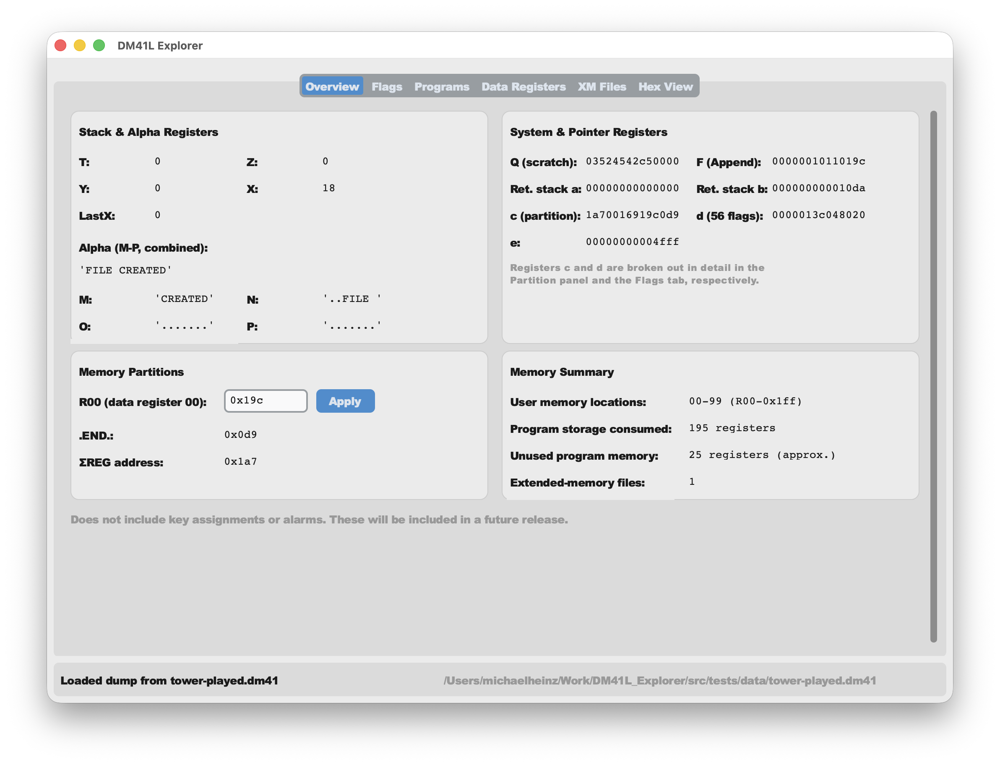
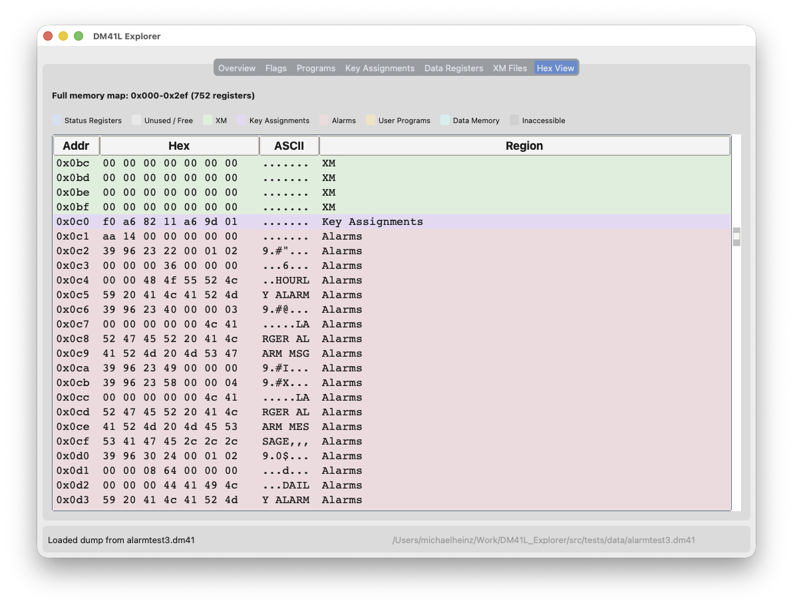
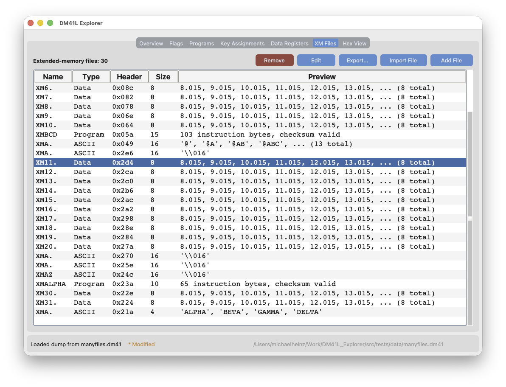
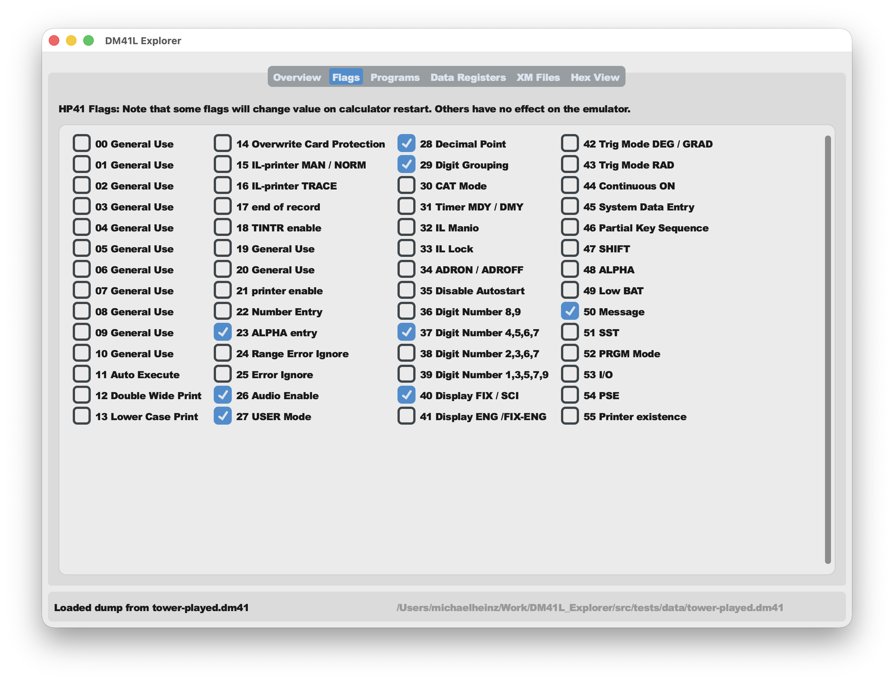
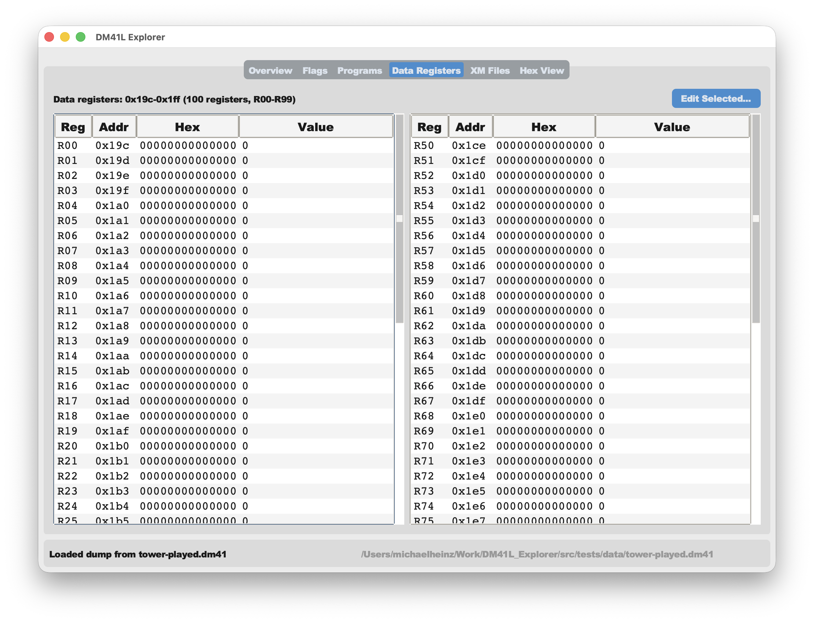
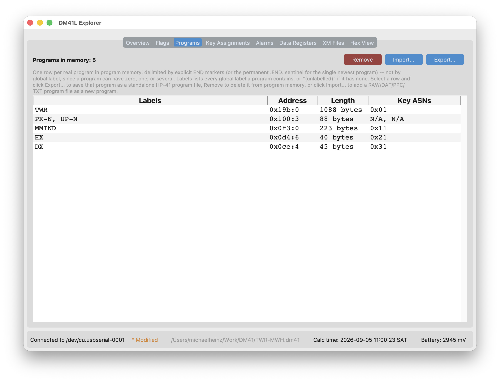

# DM41L Explorer

A Windows, MacOS, and Linux desktop GUI for reading, writing, and editing the
memory of a [DM41L](https://www.swissmicros.com/) (HP‑41CX emulator) over its
serial console.

## Screenshots

| Overview | Hex View | XM Files |
| --- | --- | --- |
|  |  |  |
|   |  |  | 


## Features

- **Overview** — A quick summary view of the contents of the DM41L's memory,
  including the stack & alpha registers, main memory, and extended memory.
  (R00/.END./ΣREG), and a memory-usage summary at a glance.
- **Flags** — all 56 status flags, named and editable.
- **Data Registers** — browse and edit the user memory registers as numbers,
  text, or raw hex.
- **Hex View** — a full, color-coded map of the entire memory space (status
  registers, extended memory, program memory, data memory, and unused space).
- **Programs** — a read-only catalog (for now) of the named programs and END
  markers found in program memory.
- **XM Files** — list, add, edit, and remove files stored in extended memory
  (Data, ASCII, and Program types).
- Connect directly to a DM41L over USB serial, or work entirely offline from a
  saved `.dm41` dump file (File > Open / Save Dump).
- Double-click a `.dm41` file (or drag it onto the app) to open it directly.

## Requirements

- Python 3.10 or later (developed and tested with 3.12).
- A DM41L connected over USB, if you want to talk to real hardware —
  otherwise you only need a `.dm41` dump file to explore.

## Running from source

```sh
git clone https://github.com/mwheinz/DM41L_Explorer.git
cd DM41L_Explorer
python3 -m venv venv
source venv/bin/activate   # on Windows: venv\Scripts\activate
pip install -r requirements.txt
cd src
python3 -m gui.app
```

On Linux, `tkinter` isn't always bundled with Python — if the app fails to
import `tkinter`, install it separately first (e.g. `sudo apt install
python3-tk` on Debian/Ubuntu).

To also run the test suite or build a standalone binary, install the
development requirements instead of just the runtime ones:

```sh
pip install -r requirements-dev.txt
```

## Building a standalone application

A PyInstaller spec (`src/dm41l.spec`) and build script (`src/build.sh`)
are included, producing a self-contained app — a macOS `.app` bundle
(with `.dm41` file association) on macOS, and a onedir bundle on Linux and
Windows.

```sh
cd src
./build.sh
```

Output lands in `src/dist/`. `build.sh` is a shell script — on Windows,
run it from Git Bash (installed alongside [Git for
Windows](https://git-scm.com/download/win)) or WSL, or invoke PyInstaller
directly with `pyinstaller dm41l.spec` after generating `dm41lversion.py`
yourself (see the comment at the top of `build.sh`).

On Linux and Windows, the executable needs the `_internal/` folder that's
built alongside it — don't separate them, or move the exe without also
moving `_internal/`. A `README.txt` explaining this ships in that same
output folder (and in every release download) for anyone unzipping it
without this context. The Linux build also includes `MyIcon.png`, ready
to use as a `.desktop` file's `Icon=` entry if you set one up yourself.

The built binaries aren't code-signed (this is an independently-developed
hobby project without an Apple or Microsoft developer account), so:

- **macOS** will refuse to open it as coming from an "unidentified
  developer" — right-click (or Control-click) the app and choose Open,
  then confirm once, instead of double-clicking it.
- **Windows** will show a SmartScreen warning — click "More info", then
  "Run anyway".

Building and running from source, as above, doesn't trigger either of
these.

## Documentation

- [`docs/memory.md`](docs/memory.md) — the DM41L memory map: status
  registers, extended memory file format, and how this tool decodes them.
- [`docs/flags.md`](docs/flags.md) — names for all 56 status flags.
- [`docs/program.md`](docs/program.md) — the program-memory "global
  chain" format (labels and END markers) used by the Programs tab.

Most of this is derived from 40 year old memories and classic HP41 texts like
"Synthetic Programming" by Jonathan Wickes, supplemented by reverse-engineering
DM41L memory dumps rather than an official spec, so treat field meanings as
well-tested hypotheses rather than certainties — see the docs for what's
confirmed versus still under research.

## Contributing

Bug reports, feature requests, and pull requests are welcome — see
[`CONTRIBUTING.md`](CONTRIBUTING.md) for how to get set up, run the
tests, and what makes a good bug report or PR.

## Known limitations

- Key assignments and alarms aren't decoded yet (Overview shows a
  placeholder note).
- Program memory is listed (names, END markers, raw chain distances) but
  not decoded into actual instructions, and can't be created or edited
  from this tool yet.

## Running the tests

```sh
pip install -r requirements-dev.txt
pytest
```

## License

See [`LICENSE`](LICENSE).
