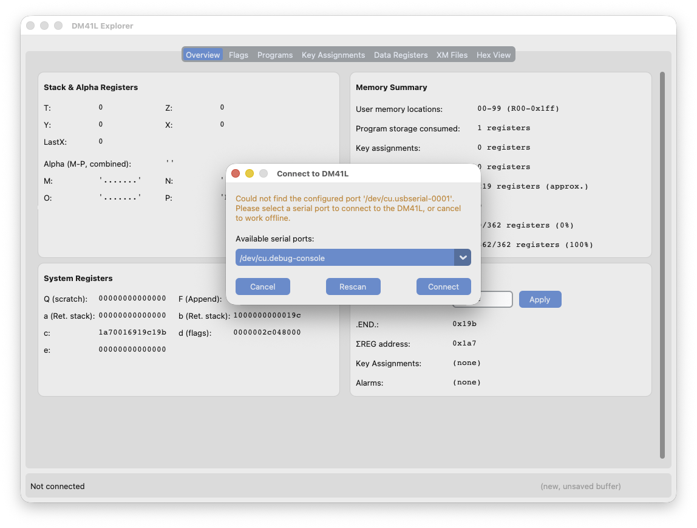
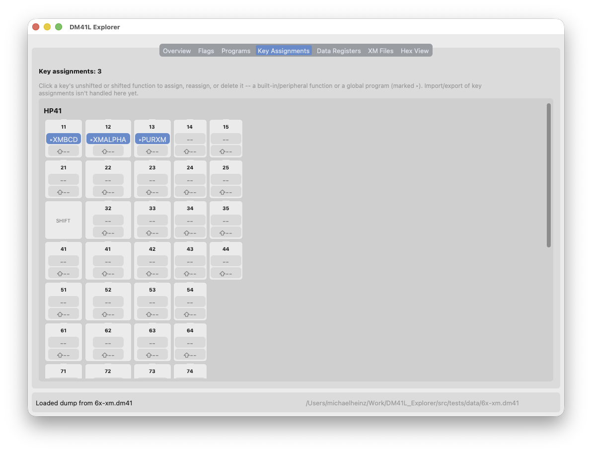

# DM41L Explorer

A Windows, MacOS, and Linux desktop GUI for reading, writing, and editing the
memory of a [DM41L](https://www.swissmicros.com/) (HP‑41CX emulator) over its
serial console.

## Features

- **Overview** — A quick summary view of the contents of the DM41L's memory,
  including the stack & alpha registers, main memory, and extended memory. Also
  shows the current values of R00, .END., ΣREG, and a memory-usage summary at
  a glance.
- **Flags** — all 56 status flags, named and editable.
- **Programs** — a read-only catalog (for now) of the named programs and END
  markers found in program memory.
- **Data Registers** — browse and edit the user memory registers as numbers,
  text, or raw hex.
- **XM Files** — list, add, edit, and remove files stored in extended memory
  (Data, ASCII, and Program types).
- **Key Assignments** - view, add, edit, and remove user key assignments.
- Connect directly to a DM41L over USB serial, or work entirely offline from a
  saved `.dm41` dump file (File > Open / Save Dump).
- **Hex View** — a full, color-coded map of the entire memory space (status
  registers, extended memory, program memory, data memory, and unused space).

## Requirements

- Python 3.10 or later (developed and tested with 3.12).
- A DM41L connected over USB, if you want to talk to real hardware —
  otherwise you only need a `.dm41` dump file to explore.

## Running from source

```sh
git clone https://github.com/mwheinz/DM41L_Explorer.git
cd DM41L_Explorer
python3 -m venv venv
source venv/bin/activate   # on Windows: venv\Scripts\activate
pip install -r requirements.txt
cd src
python3 -m gui.app
```

On Linux, `tkinter` isn't always bundled with Python — if the app fails to
import `tkinter`, install it separately first (e.g. `sudo apt install
python3-tk` on Debian/Ubuntu).

To also run the test suite or build a standalone binary, install the
development requirements instead of just the runtime ones:

```sh
pip install -r requirements-dev.txt
```

## Building a standalone application

A PyInstaller spec (`src/dm41l.spec`) and build script (`src/build.sh`)
are included, producing a self-contained app — a macOS `.app` bundle
(with `.dm41` file association) on macOS, and a onedir bundle on Linux and
Windows.

```sh
cd src
./build.sh
```

Output lands in `src/dist/`. `build.sh` is a shell script — on Windows,
run it from Git Bash (installed alongside [Git for
Windows](https://git-scm.com/download/win)) or WSL, or invoke PyInstaller
directly with `pyinstaller dm41l.spec` after generating `dm41lversion.py`
yourself (see the comment at the top of `build.sh`).

On Linux and Windows, the executable needs the `_internal/` folder that's
built alongside it — don't separate them, or move the exe without also
moving `_internal/`. A `README.txt` explaining this ships in that same
output folder (and in every release download) for anyone unzipping it
without this context. The Linux build also includes `MyIcon.png`, ready
to use as a `.desktop` file's `Icon=` entry if you set one up yourself.

The built binaries aren't code-signed (this is an independently-developed
hobby project without an Apple or Microsoft developer account), so:

- **macOS** will refuse to open it as coming from an "unidentified
  developer" — right-click (or Control-click) the app and choose Open,
  then confirm once, instead of double-clicking it.
- **Windows** will show a SmartScreen warning — click "More info", then
  "Run anyway".

Building and running from source, as above, doesn't trigger either of
these.

## Using DM41L_Explorer

### Launching the app for the first time

You can launch DM41L_Explorer either with or without your DM41L already
connected via USB.

To prepare your DM41L for connection, you must enable the serial console, which
is activated by turning the calculator off, then pressing \<ON\> and "C" at the
same time, then releasing them. 

Once your calculator is in SERIAL CONSOLE mode and connected to your computer
with a USB cable, launch DM41L_Explorer. You will see a dialog box similar to
this one:



Select the appropriate serial port and click connect. Once connected you will
see the Overview tab.

#### Which serial port do I use? 

Good question. You may have to do some trial-and-error to figure this out. If
you're not sure if the correct serial port is even listed, try clicking the
"Rescan" button. Once you've successfully connected, however, DM41L Explorer
will save the port you used and automatically select it the next time you
launch.

#### Launching without the DM41L

If you want to work on an existing memory dump file (or create a new one) just
click "Cancel" when the connection dialog appears. If, later, you decide to
connect to the DM41L, just go to the Connect menu and select Connect/Reconnect.

#### Loading and saving memory dump files

During the initial launch of DM41L Explorer, it will try to automatically
connect to the DM41L and, if it does connect it will load the current contents
of the calculator's memory. If you want to load a dump from the calculator
again later, use the Connect menu.

To write a memory dump to the calculator, the Connect menu has you covered
there, too.

The File menu contains options to load an existing memory file from disk, to
save the currently loaded dump, and for creating a blank one to work on.

### Overview Tab


The Overview tab shows a quick summary of either the state of the DM41L or the
currently loaded memory dump. It is almost entirely read-only, except for the
address of the R00 register, which you can adjust if you want to experiment
with synthetic programming.

### Flags Tab


A complete list of the all the user and system flags and their current values.
Please note that many of the system flags are used by the DM41L itself during
normal operation, while others pertain to peripherals and will have no effect on the
DM41L. Your Mileage May Vary.

### Programs Tab

 

The programs tab shows a scan of the DM41L's program memory. At the moment this
is strictly read-only.

### Key Assignments Tab



The Key Assignments tab allows you to view and edit the user key assignments in
the loaded dump. It displays the keys both in the original HP41 layout and (if
you scroll down) the DM41L layout. Clicking on a key will let you edit that
key's current assignment - you can either select one of the built-in HP41CX
functions, or one of the currently loaded programs, or enter in two hexadecimal
bytes if you want to experiment with synthetic programming.

### Data Registers Tab


The Data Registers view shows the contents of user memory, and allows you to
import, export, and alter portions of it. It's broken into two halves (to make
better use of space) and you can enter BCD, ASCII, or hexadecimal data into any
register. Select a register with the mouse, then click on the desired action.

### XM Files Tab


The XM Files view is organized similarly to the Data Registers view, and allows
you to import, export, and alter files in Extended Memory. Unlike the Data
Registers view, XM Files does limit you to either BCD or ASCII data, and
Program files cannot be altered at this time.

### Hex View Tab


The Hex view shows the raw contents of calculator memory, color-coded by the
region. It is useful for studying how HP41 memory is organized.

## Documentation

There are many markdown files in the [`docs`] directory. These represent my
research notes from developing this project. Hopefully they will be useful to
you if you are curious about the internals of the HP41 and the DM41L emulator.

Most of my notes are derived from 40 year old memories and classic HP41 texts
like *Synthetic Programming* by Jonathan Wickes, supplemented by
reverse-engineering DM41L memory dumps. Other sources include *A Programmer's
Handbook* by Poul Kaarup, *HP-41 Advanced Programming Tips* by Alan McCornack &
Keith Jarett, and *Synthetic Programming Made Easy* by Keith Jarett. Other
information came from conducting experiments and studying the resulting memory
dumps

## Contributing

Bug reports, feature requests, and pull requests are welcome — see
[`CONTRIBUTING.md`](CONTRIBUTING.md) for how to get set up, run the
tests, and what makes a good bug report or PR.

## Known limitations

- Alarms aren't decoded and cannot be altered yet.
- Program memory is listed (names, END markers, raw chain distances) but
  not decoded into actual instructions, and can't be created or edited
  from this tool yet.

## Running the tests

```sh
pip install -r requirements-dev.txt
pytest
```

## License

See [`LICENSE`](LICENSE).
